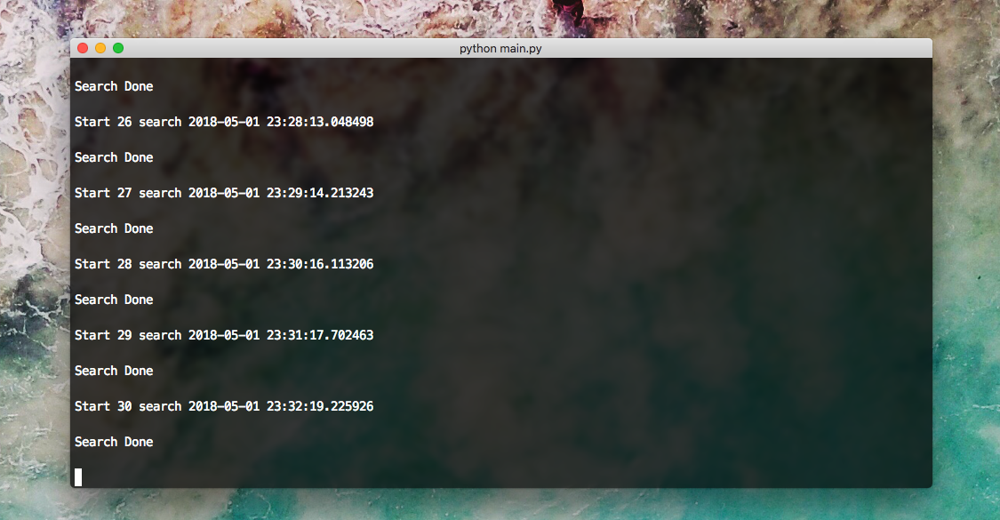
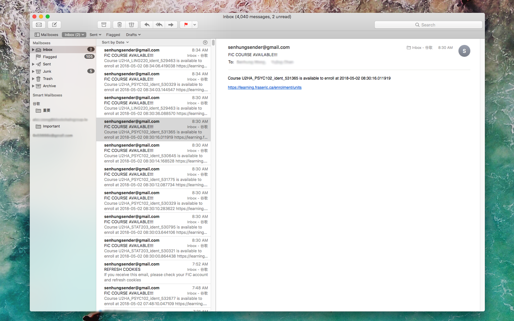

# FIC Enrollment Course Tracker

## Description

[FIC](https://www.fraseric.ca/) does not have waiting list in their enrollment system, so when one drops the course, anyone can enroll.
The scripts are used for tracking if specific courses become available and will notify user through email.

## Requirements

The scripts are written in `Python 2.7`

Requires:

 - [Beautiful Soup](https://www.crummy.com/software/BeautifulSoup/bs4/doc/)
 - [LXML](http://lxml.de/)

## How To Use

1. Set Config

Copy `config.example.py` and rename it to `config.py`

Fill out the configurations

2. Run Script

```bash
$ python main.py
```

## Configurations

### SMTP

Only Gmail is supported. Also requires to turn off [less secure apps](https://myaccount.google.com/lesssecureapps). (Create yourself a new gmail account and use that will be more secure)

### COOKIES

`COOKIES` can be get from developer tool -> network when login in FIC website

### COURSES 

You need to get the course id from developer tool -> elements when enrolling courses

Some sample courses: 
 - `U2HA_STAT203_ident_530321`, 
 - `U2HA_ENGL112_ident_532508`

### URL

You need to get the url from developer tool -> network when click on a course and see its lists

Some sample urls: 
 - `https://learning.fraseric.ca/enrolment/enrol?page=1&course=U2HA&subj=STAT203&dojo.preventCache=...`, 
 - `https://learning.fraseric.ca/enrolment/enrol?page=1&course=U2HA&subj=ENGL112&dojo.preventCache=...`

## Auto Enrollment

Enrollment script is added but requires additional edit to be use.

### Example

```python
from enroller import enroll

courses = ["530321", "532508", "529463"]

# enroll courses with id 530321, 532508 and 529463
enroll(courses)

```

Note: The numbers in `courses` are the last six digits numbers from developer tool -> elements when enrolling courses

## Screenshots




